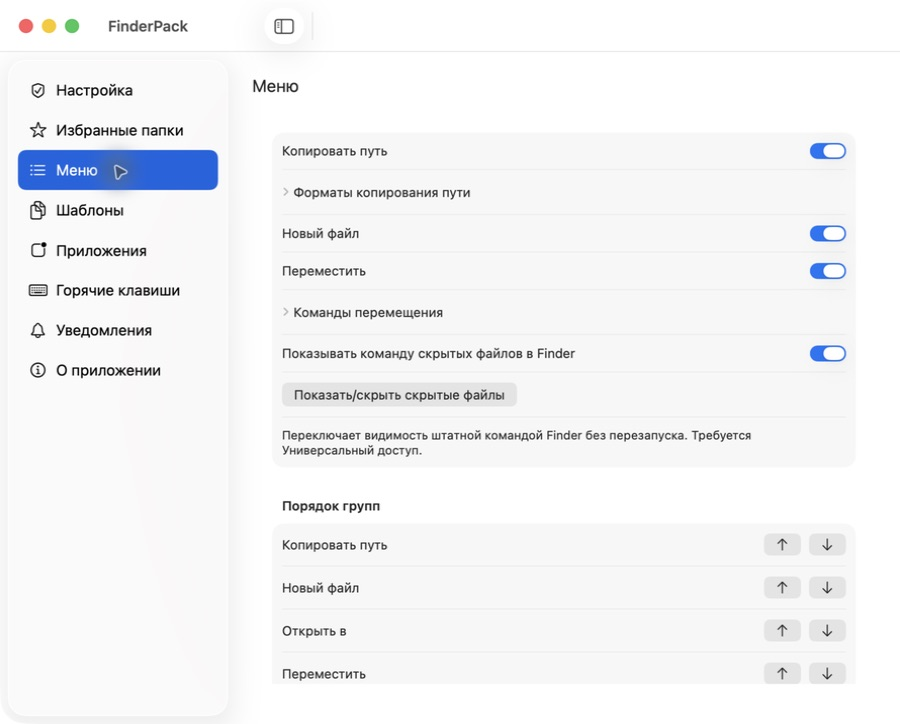
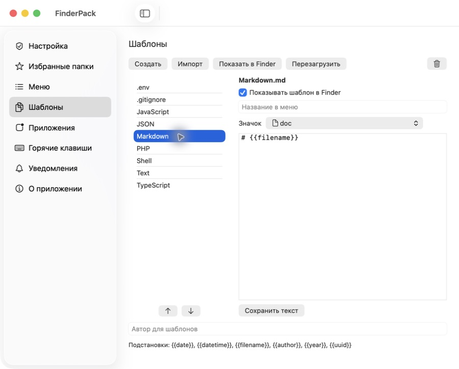
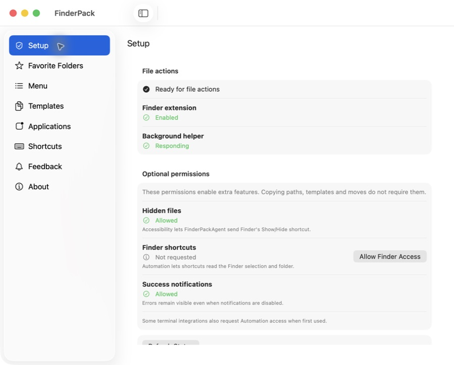

# FinderPack

**Create files, copy useful paths and move things faster, right from Finder.**

FinderPack is a small macOS utility that adds commands to Finder's right-click menu.
Create a Markdown note in the folder you are looking at, copy a path ready for Terminal,
open a project in your editor, or move files to a recently used folder. Keep using Finder
as usual; open the FinderPack app when you want to change its settings.

[Download for macOS](https://github.com/shumer/FindexExtension/releases/latest) ·
[Installation](#install-and-enable) · [First steps](#try-it-in-a-minute) ·
[Report a problem](https://github.com/shumer/FindexExtension/issues)

**macOS 14+ · Apple Silicon and Intel builds · English, Russian, Ukrainian and Polish**

*Screenshots show FinderPack with the English interface.*

## What can I do with it?

| When you want to... | Use this Finder command |
| --- | --- |
| Create a text file without opening an editor first | **New File** > Text, Markdown, JSON or another template |
| Paste a filename or path into a message, script or Terminal | **Copy Path** > the format you need |
| Open the current folder in a terminal or editor | **Open In** > an installed application |
| Move files to another folder | **Move** > Choose Folder or a recent destination |
| Cut files and move them somewhere else | **Move** > Cut, then **Paste and Move** in the destination |
| Show dotfiles such as `.env` and `.gitignore` | **Show/Hide Hidden Files** |
| Reverse a FinderPack move | **Move** > Undo Last Move, or find the operation in settings |

Commands are available when right-clicking files, folders and empty space inside a
Finder folder. Actions depend on the current selection and location. Finder's own
**New Folder** command stays where it is; FinderPack adds file templates alongside it.

## Install and enable

You do not need Xcode, Homebrew or a developer account to install a release.

1. Open the [latest release](https://github.com/shumer/FindexExtension/releases/latest)
   and download **`FinderPack-<version>-<build>.dmg`** from **Assets**.
   Choose the DMG, not GitHub's Source code archive. The same download contains both
   Apple Silicon and Intel binaries.
2. Open the DMG and drag **FinderPack** to **Applications**.
3. Launch **FinderPack from Applications**, then eject the disk image.
4. Click **Open Extension Settings** and enable **FinderPack** in the macOS extension
   settings that open. The location and wording vary by macOS version.
5. Click **Connect** to enable the background helper. If macOS asks for background
   approval, allow FinderPack and return to the app.
6. Open a Finder folder and right-click an empty area. Look for **New File**,
   **Copy Path**, **Open In** and **Move**. Close and reopen the menu after changing
   settings; updates can take up to five seconds.

Use the **Setup** page to check extension activation, helper connectivity and optional
permissions. A screenshot of this page appears below.

Release downloads are Developer ID signed and notarized by Apple. If macOS reports
that a download is damaged or cannot be verified, download it again from the release
page and [report the exact message](https://github.com/shumer/FindexExtension/issues)
if it persists. Do not disable Gatekeeper to install it.

## Try it in a minute

1. **Make a note:** right-click empty space in a folder, then choose **New File > Markdown**.
   FinderPack creates a file there. Existing files are preserved by choosing a numbered name.
2. **Copy its name:** right-click the new file, then choose **Copy Path > Filename**.
   Paste into a text field to see the result.
3. **Move it:** choose **Move > Choose Folder**, pick a destination, then try
   **Undo Last Move** to return it. Use a disposable file for your first test.

Copy Path also offers an absolute path, a shell-quoted path, a file URL, a path relative
to the current folder, home or Git repository, a name without its extension and a parent
folder. Git-relative output appears once the repository is detected.

**Paste (Copy)** keeps the source. **Paste and Move** uses FinderPack's Cut command.
**Move Copied Files Here** is a separate command that explicitly moves copied files.

## Make it yours

### Keep the menu short

In **Menu**, choose which command groups appear and change their order. In
**Applications**, hide editors or terminals you do not use. Only detected applications
appear in Finder's Open In menu.

Expand the path or move options to hide individual
commands. Hide a template from its editor without deleting the template file.
These choices affect Finder menus; your recorded shortcuts keep working.

### Create files from your own templates

Open **Templates**, choose an existing template and edit its contents, or use **Import**
to add your own files. You can also drag files into the template list. Change each
entry's menu label, icon and order to suit your work.

Built-in templates include plain text, Markdown, JSON, JavaScript, TypeScript, PHP,
shell, `.env` and `.gitignore`. Use `{{date}}`, `{{filename}}` or `{{author}}` in text
for automatic substitutions. See [all template tokens and limits](docs/usage.md#templates).

### Pin folders you move to often

Open **Favorite Folders > Add Folders**, select your
usual destinations, then give them short labels and arrange them with the arrows.
Up to 20 favorites appear before the five recent destinations in the Move menu.

Removing a pin does not delete the folder. If a destination is missing or offline,
the move stops. Re-add a favorite after moving or renaming its folder.

### See what still needs setup

**Setup** checks the Finder extension, background helper
connection and optional permissions. If something needs attention, use the button
beside it to connect the helper or open the relevant macOS settings.

Opening this page checks status without requesting new permissions.

| Permission | What it enables | Needed for basic file commands? |
| --- | --- | --- |
| Finder extension and background helper | Finder menus and command execution | Yes |
| Accessibility for FinderPackAgent | Show/Hide Hidden Files using Finder's native shortcut | No |
| Automation for Finder | Reading the Finder selection for recorded shortcuts | No |
| Automation for some terminal apps | Opening a location through their integration | No |
| Notifications | Success messages | No |

Grant optional permissions when you use the corresponding feature. Hidden-file switching
uses Finder's native shortcut without restarting Finder. Errors remain visible even if
you disable success notifications.

## Questions and fixes

**I installed it, but the menu is missing.** Open FinderPack from Applications, check
that the extension is enabled and the helper is connected, then close and reopen the
Finder context menu. Check that the relevant group is enabled in Menu settings.

**Show/Hide Hidden Files does nothing.** Allow **FinderPackAgent** in **System Settings >
Privacy & Security > Accessibility**, then retry. It is a toggle, so its title does not
claim whether hidden files are currently visible.

**Why is my terminal or editor missing?** Open In lists supported applications that are
installed and enabled in settings. See the [supported integrations](docs/usage.md#applications-shortcuts-and-permissions).
Third-party terminal integrations still need broader runtime testing.

**How does undo work?** FinderPack keeps its own move history. Use its Undo command,
not Finder's Command-Z. It will not overwrite an occupied original path or silently
restore a file that has changed. Recovery copies can use disk space and are not
silently deleted. See [file operations and recovery](docs/usage.md#file-operations-and-recovery).

**How do I update?** Open **About > Check for Updates**. Signed releases use Sparkle
to download and install updates. The helper reconnects after relaunch. You can also
download the latest DMG manually.

**How do I uninstall?** In **About**, click **Disconnect Helper**, quit FinderPack,
then move the app from Applications to Trash. Templates and recovery files remain
in its shared container; review them before deleting that data.

## Compatibility and project status

FinderPack is an early release. Builds target macOS 14 and later and contain both
Apple Silicon and Intel binaries. Installed runtime checks currently cover Apple
Silicon on macOS 26.6.2, including file creation, move/undo, hidden-file switching and
a public Sparkle update. Other macOS versions, Intel, cloud/network locations and
clean-machine installation still need broader verification.

See [tested behavior and known limits](docs/verification.md) and the [roadmap](docs/roadmap.md).
When reporting a problem, include your macOS version, FinderPack version and steps to
reproduce it. Remove personal paths and file contents from logs or screenshots.

## For contributors

- [Build locally with Command Line Tools](docs/development.md). Full Xcode is not required.
- [Detailed usage and recovery behavior](docs/usage.md).
- [Architecture](docs/architecture.md), [product specification](docs/Specification.md)
  and [selected design](docs/DesignSpec.md).
- [Signing, CI and release setup](docs/release.md).
- [Repository rules](CLAUDE.md).
